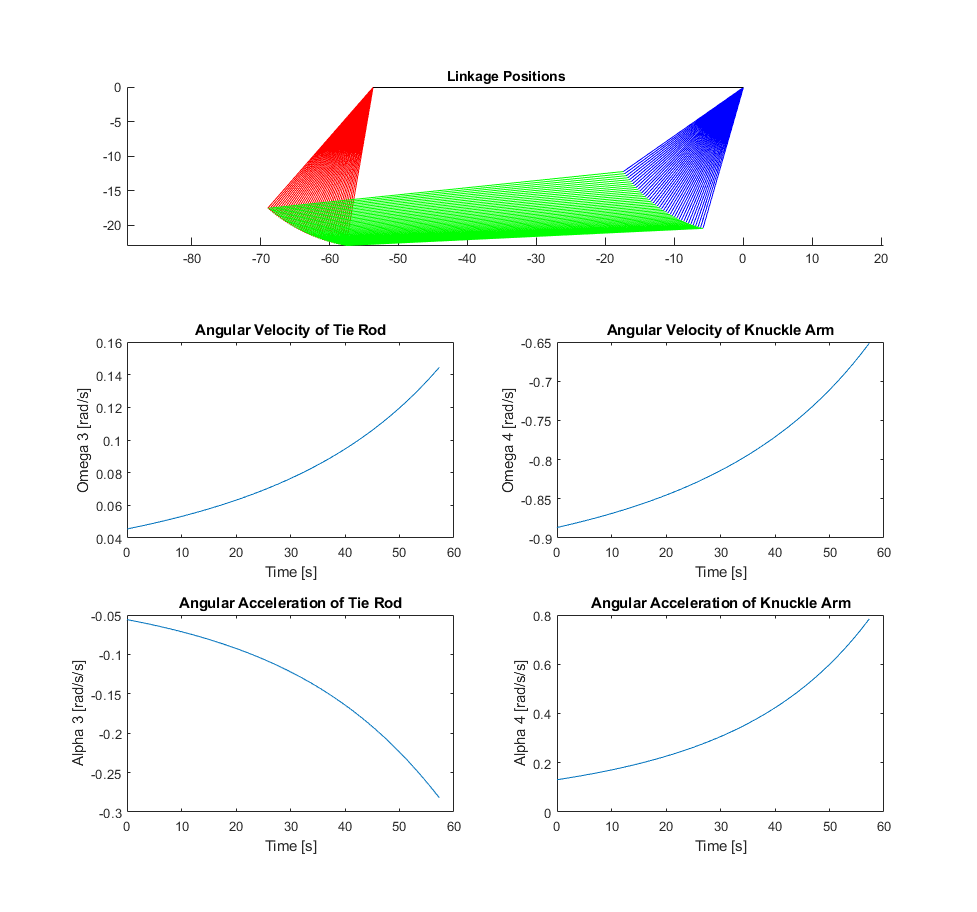

# 4-Bar-Linkage-Sim

MATLAB simulation to plot the range of motion of a 4 bar linkage. Project was completed for M E 419 at Iowa State University. The image below shows the graphs generated by the script.

